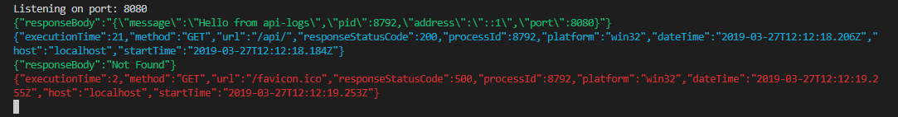
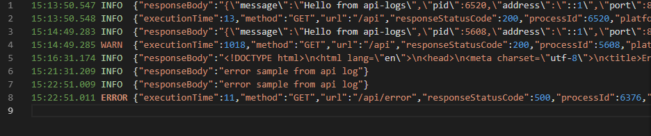

# api-logs

This package helps you to log **HTTP requests** in **Express** Node.js application.

# Installation

    npm install --save api-logs

# Usage

You can intialize the instance of the api-logs and then use it as a middleware in your application. By default this module will print logs in a console and create a log file in root directory if you don't pass any parameters, but you can control the console log printing based on the **env** key in the options as shown below.

Please note that this **env** key will have an array of environments as value. These environments will be compared with **process.env.NODE_ENV** variable. 

### Parameters Table
| Name | Default | Description | 
|:------:|:------:|:------|
| env | all | array of environments for which you want to print the console logs. example ['dev', 'uat'] etc |
| logdir | . | path of the log directory, by default it will create file in the root dir. example logs, var/logs/api-logs etc |
| maxExecTime | 60000 | maximum execution time for any service after which you want to log warnings. | 

### using api-logs without any options argument

    var app = require('express')();
    var apiLogs = require('api-logs');
    
    app.use(apiLogs());
	    
	app.get('/', function(req, res){
		res.send('Hello from api-logs');
	});
	
	app.listen(8080);

### using api-logs with options argument
If you want to restrict logging to perticular environments, you can pass it in the options

    var app = require('express')();
    var apiLogs = require('api-logs');
    
    let apilogOptions = {
	    env: ['dev', 'uat'],
	    logdir: 'logs',
		maxExecTime: 60000
    };
    
    app.use(apiLogs(apilogOptions));
	    
	app.get('/', function(req, res){
		res.send('Hello from api-logs');
	});
	
	app.listen(8080);

## Sample output

  

#### console output

  

#### log file output

